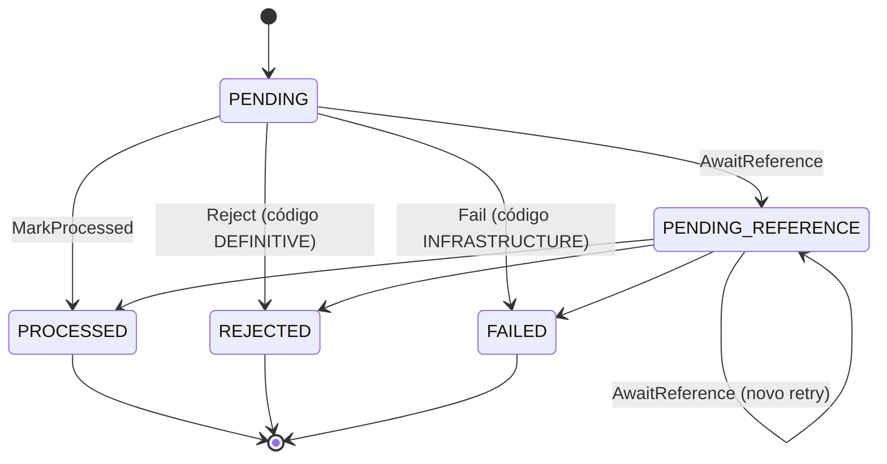
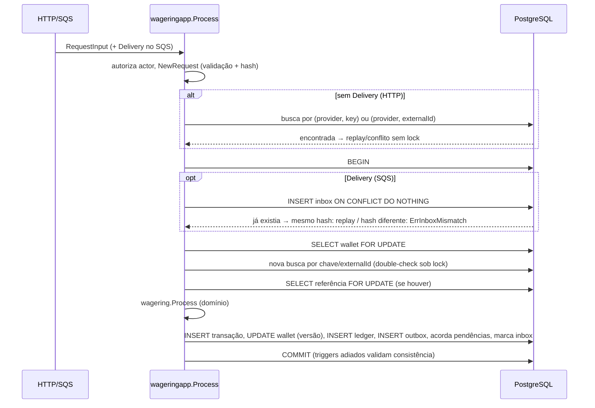

# Arquitetura

Registro das decisões técnicas da solução. Cada seção é preenchida junto com a implementação correspondente; o progresso por requisito está em [`docs/REQUIREMENTS.md`](docs/REQUIREMENTS.md).

## Visão geral

Arquitetura hexagonal (ports & adapters):

```
cmd/wallet/          binário único (API, workers, subcomando migrate)
internal/domain/     modelo puro: money, wallet, wagering, event
internal/app/        casos de uso e ports (interfaces)
internal/adapter/    postgres, http, auth, aws, sqsconsumer
internal/worker/     outbox, pendingref, runner
internal/platform/   config, logger, metrics, tracing, health, faultinject
internal/fxapp/      módulos Fx e seleção de roles
```

Regra de dependência: `domain` ← `app` ← `adapter`/`worker` ← `fxapp` ← `cmd`. O domínio não importa Fx, HTTP, SQS nem bibliotecas de persistência.

## Decisões

| Tema | Decisão | Seção |
|---|---|---|
| Go | 1.27.1 em `go.mod` e `golang:1.27.1-alpine` no Dockerfile | — |
| Dinheiro | `int64` em unidades mínimas, `BIGINT` no Postgres, formato estrito | [Dinheiro](#dinheiro) |
| Concorrência | Lock pessimista por carteira + versão condicionada + constraints | [Concorrência](#concorrência) |
| Banco | `pgx/v5` com SQL explícito, `golang-migrate`, PostgreSQL 18 | [Persistência](#persistência) |
| Idempotência | Chave + hash persistidos, replay sem lock, double-check sob lock, unicidade como rede final | [Idempotência](#idempotência) |
| Autorização | Verificada também nos casos de uso via `app.Actor` | [Casos de uso](#casos-de-uso) |
| Invariantes | Constraints, FKs compostas, índices parciais, triggers e constraint triggers adiados; aplicação sem `UPDATE`/`DELETE` no ledger | [Invariantes impostas pelo banco](#invariantes-impostas-pelo-banco) |
| Mensageria local | LocalStack `4.14.0` community | [Mensageria](#mensageria) |
| Reversões | Cada transação revertida no máximo uma vez | [Reversões](#reversões) |
| Referências pendentes | TTL (padrão 30 min) + backoff exponencial com jitter; `WIN` com referência também aguarda | [Referências](#referências) |
| Validação de carteira | Carteira inexistente/de outro jogador/outra moeda é erro corrigível, não persistido | [Serviço de domínio](#serviço-de-domínio-process) |
| Identificadores externos | ASCII visível sem normalização; UUIDs canônicos minúsculos | [Requisição externa](#requisição-externa-request) |

## Dinheiro

Pacote `internal/domain/money`.

### Representação

`Money` é um value object imutável com dois campos não exportados: `minor int64` (unidades mínimas, centavos) e `currency Currency`. Todas as moedas suportadas usam escala fixa `Scale = 2`.

| Aspecto | Decisão |
|---|---|
| Tipo interno | `int64` em unidades mínimas |
| Faixa representável | `-92233720368547758.08` a `92233720368547758.07` |
| Moedas suportadas | `BRL`, `USD`, `EUR` (ISO 4217, todas com 2 casas) |
| Persistência | `BIGINT` (unidades mínimas) + `CHAR(3)` (código da moeda) |
| Contrato externo | `{"amount":"25.00","currency":"BRL"}` |
| Ponto flutuante | Proibido: nenhuma função usa `float32`/`float64`; o `golangci-lint` (`forbidigo`) bloqueia os tipos e `strconv.ParseFloat` fora de métricas |

`Currency` é uma struct com campo não exportado: só pode ser obtida pelas variáveis `money.BRL/USD/EUR` ou por `ParseCurrency`, o que impede moedas arbitrárias. O valor zero de `Money` e de `Currency` é inválido e rejeitado por aritmética, comparação e serialização (`ErrUninitialized`).

### Parsing estrito

Gramática aceita: `("0" | [1-9][0-9]*) "." [0-9]{2}`.

- Rejeitados com `ErrInvalidAmount`: vazio, `25`, `25.0`, `25.000`, `.50`, `025.00`, `+25.00`, `2.5e1`, `NaN`, `Infinity`, separadores (`1,000.00`), espaços, dígitos não ASCII e números JSON (`"amount": 25.00`).
- Rejeitados com `ErrNegativeAmount`: qualquer valor com sinal em `Parse` (entrada externa).
- Rejeitados com `ErrOverflow`: valores acima do limite de `int64`.
- Moeda precisa ser exatamente um código suportado em maiúsculas (`brl` é rejeitado com `ErrInvalidCurrency`).

**Não há normalização nem arredondamento**: cada valor aceito tem uma única forma textual, e `Amount()` devolve exatamente a string recebida. Por isso o hash de idempotência usa a string original sem transformação.

O parsing valida todo o formato antes de acumular dígitos (assim uma entrada malformada nunca é classificada como overflow) e acumula no lado negativo de `int64`, o que cobre `math.MinInt64` sem conversões `uint64 → int64`.

`ParseSigned` aceita sinal negativo e existe apenas para valores internos (por exemplo, `difference` da reconciliação); adaptadores de entrada usam `Parse`.

### Operações

`Add`, `Sub`, `Neg` e `Cmp` retornam erro em vez de causar panic:

- `ErrCurrencyMismatch` para moedas diferentes;
- `ErrOverflow` quando o resultado sai da faixa de `int64` (inclusive `-MinInt64`);
- `ErrUninitialized` para operandos no valor zero.

`Equal` não falha: moedas diferentes simplesmente não são iguais. Valores negativos são permitidos em cálculos internos; a não negatividade do saldo é responsabilidade do agregado `Wallet` e de `CHECK` no banco.

### Erros

Sentinelas classificáveis com `errors.Is`: `ErrInvalidAmount`, `ErrNegativeAmount`, `ErrInvalidCurrency`, `ErrCurrencyMismatch`, `ErrOverflow`, `ErrUninitialized`.

### Testes

- Tabelas cobrindo entradas válidas, inválidas, limites de `int64`, overflow em parsing/soma/subtração/negação, moedas incompatíveis, valor não inicializado e JSON.
- `FuzzParse` compara o parser com um oráculo independente (regex + `math/big`): toda entrada aceita pertence à gramática, cabe em `int64`, tem o valor exato e volta à mesma string; toda rejeição é classificada. O corpus em `testdata/fuzz` preserva uma regressão encontrada pelo fuzzer (entrada malformada classificada como overflow).

## Carteira e ledger

Pacote `internal/domain/wallet`.

### Agregado `Wallet`

Raiz do agregado financeiro, com estado não exportado: `id`, `playerID`, `balance` (`Money`, que carrega a moeda), `version`, `loadedVersion`, `createdAt` e `updatedAt` (sempre em UTC).

| Operação | Comportamento |
|---|---|
| `Open` | Cria a carteira com versão `1`. Saldo inicial positivo gera o lançamento de crédito da abertura (`0.00 → saldo`, `walletVersion = 1`) vinculado ao `OPENING`; saldo zero não gera lançamento. Saldo negativo é rejeitado. |
| `Rehydrate` | Reconstrói a partir do banco **sem** gerar lançamentos nem alterar versão. Valida as invariantes (saldo não negativo, versão ≥ 1, timestamps coerentes) para detectar dados corrompidos. |
| `Debit` / `Credit` | Exigem valor positivo e mesma moeda. Débito exige saldo suficiente (`ErrInsufficientFunds`). Cada movimentação devolve o `LedgerEntry` correspondente, incrementa a versão em 1 e só avança `updatedAt`. |
| `CanDebit` | Consulta de saldo suficiente sem alterar estado. |

Qualquer rejeição deixa o agregado intacto: o lançamento é construído e validado **antes** de alterar saldo e versão.

`loadedVersion` guarda a versão lida do banco. O repositório a usa no `UPDATE … WHERE version = $loadedVersion`, que detecta escritas concorrentes mesmo que o lock de linha falhe (ver [Concorrência](#concorrência)). `IsNew()` e `HasChanges()` informam se a carteira precisa de `INSERT`, `UPDATE` ou nenhuma escrita (por exemplo, `LOSS`).

A unicidade de `(playerId, currency)` não cabe no agregado (exige visão de todas as carteiras) e é garantida por `UNIQUE` no banco.

### `LedgerEntry`

Lançamento imutável (campos não exportados, somente getters): `id`, `walletId`, `transactionId`, `direction` (`DEBIT`/`CREDIT`), `amount`, `balanceBefore`, `balanceAfter`, `walletVersion` e `createdAt`.

A construção valida:

- identidades não nulas, `walletVersion ≥ 1` e timestamp presente;
- `amount > 0`, saldos não negativos e mesma moeda nos três valores;
- `balanceAfter = balanceBefore − amount` (débito) ou `balanceBefore + amount` (crédito), com aritmética checada contra overflow.

Lançamentos só são criados pelo agregado (`Open`, `Debit`, `Credit`). `RehydrateLedgerEntry` aplica as mesmas validações ao ler do banco.

`walletVersion` é a versão da carteira **após** o lançamento. Como toda mudança de saldo incrementa a versão exatamente uma vez, `(walletId, walletVersion)` é único e sequencial: serve como cursor estável da paginação e como prova, no banco, de que nenhuma atualização foi perdida.

### Erros

`ErrInvalidWallet`, `ErrInvalidLedgerEntry`, `ErrInvalidAmount`, `ErrCurrencyMismatch`, `ErrInsufficientFunds`, `ErrBalanceOverflow`, todos classificáveis com `errors.Is`.

## Transações de aposta

Pacote `internal/domain/wagering`.

### Requisição externa (`Request`)

HTTP e SQS convertem seus corpos em `RequestInput` (somente strings) e chamam `wagering.NewRequest`, que é o **único** ponto de validação de entrada. Assim as duas portas aplicam exatamente as mesmas regras e produzem o mesmo hash.

| Campo | Regra |
|---|---|
| `providerId`, `externalTransactionId`, `roundId`, `gameId` | Obrigatórios, 1–128 bytes, apenas ASCII visível (`!`–`~`). Sem trim: espaços são rejeitados, não removidos. |
| `idempotencyKey` | Obrigatório, 1–255 bytes, ASCII visível. |
| `playerId`, `walletId` | UUID na forma canônica minúscula com hífens (`uuid.String()`); maiúsculas, chaves, `urn:` e UUID nulo são rejeitados. |
| `kind` | `BET`, `WIN`, `LOSS`, `REFUND` ou `ROLLBACK`. `OPENING` é rejeitado com `OPENING_NOT_ALLOWED`. |
| `money` | `money.Parse` estrito (ver [Dinheiro](#dinheiro)). |
| Valor zero | `LOSS` exige `0.00` (`LOSS_AMOUNT_MUST_BE_ZERO`); os demais exigem valor > 0 (`AMOUNT_MUST_BE_POSITIVE`). |
| `referenceExternalTransactionId` | Obrigatório em `REFUND`/`ROLLBACK`, opcional em `WIN`, proibido em `BET`/`LOSS`; não pode ser igual ao próprio `externalTransactionId`. |

Erros de validação são `*ValidationError{Code, Field, Reason}`, classificáveis por `errors.As` e por `errors.Is(err, ErrValidation)`.

### Hash de idempotência

Como a entrada é estrita, **não existe normalização**: toda requisição aceita tem uma única forma textual. O hash é `SHA-256` do JSON canônico abaixo, gravado como `BYTEA` (32 bytes) e exposto em hexadecimal minúsculo.

- Chaves ordenadas lexicograficamente, sem espaços, UTF-8, sem escape de HTML (compatível com RFC 8785 para strings ASCII).
- Campos: `externalTransactionId`, `gameId`, `kind`, `money.amount`, `money.currency`, `playerId`, `providerId`, `referenceExternalTransactionId` (omitido quando ausente), `roundId`, `walletId`.
- Excluídos: `idempotencyKey`, `messageId`, `type`, `occurredAt`, headers e qualquer metadado de transporte.

Exemplo (golden test `TestCanonicalPayloadGolden`):

```json
{"externalTransactionId":"transaction-123","gameId":"fortune-chimp","kind":"BET","money":{"amount":"25.00","currency":"BRL"},"playerId":"0192f28f-5dc0-7d58-bdb2-814ad6a0f4a1","providerId":"provider-a","roundId":"round-987","walletId":"0192f291-27dd-7d3f-8071-5f8685deef37"}
```

`sha256 = 629836932b79106b99523d06a1e7fa80689b0ea1e1c47aa3f0a5a2c87d0c4344`

O JSON é montado manualmente (sem reflexão) e um teste compara o resultado com `encoding/json` sobre um mapa ordenado para inputs com `"`, `\` e `<&>`, garantindo equivalência byte a byte.

### Entidade `Transaction`

Estado não exportado; construtores distintos por origem:

| Construtor | Uso |
|---|---|
| `NewExternal(id, Request, now)` | Operação de provedor; inicia em `PENDING` com todos os metadados externos e o hash. |
| `NewOpening(OpeningParams)` | Abertura interna; `origin = INTERNAL`, `kind = OPENING`, sem provedor, IDs externos, chave, hash, rodada, jogo ou referência. Valor precisa ser positivo. |
| `Rehydrate(RehydrateParams)` | Leitura do banco: valida a consistência completa (origem × metadados, tipo × valor, estado × dados de conclusão) sem executar transições nem gerar eventos. |

Transições explícitas: `MarkProcessed`, `Reject`, `Fail`, `AwaitReference`. Cada uma valida o estado de origem e os dados exigidos pelo estado de destino.

### Máquina de estados



- Estados terminais (`PROCESSED`, `REJECTED`, `FAILED`) recusam qualquer transição com `ErrInvalidTransition`, sem alterar o estado.
- `PROCESSED` exige resultado (saldo e versão da carteira após o processamento) e, se houver referência, o ID interno resolvido.
- `REJECTED` só aceita códigos de categoria `DEFINITIVE` e registra o saldo observado no momento da rejeição.
- `FAILED` só aceita códigos de categoria `INFRASTRUCTURE`.
- `PENDING_REFERENCE` exige `nextAttemptAt` e `expiresAt`; `expiresAt` é fixado na primeira espera e nunca muda; cada nova espera incrementa `attempts`.

### Serviço de domínio `Process`

`wagering.Process` concentra a regra de negócio e é usado tanto pelo processamento síncrono (HTTP/SQS) quanto pelo worker de pendências. Recebe a transação, a carteira **já bloqueada**, a referência resolvida (se houver), o ID do lançamento, o instante atual e a política de espera, e devolve uma `Decision` (`PROCESSED`, `REJECTED` ou `AWAITING_REFERENCE`) com o lançamento criado, quando existir. A camada de aplicação apenas carrega, persiste e publica.

| Tipo | Movimento | Código em saldo insuficiente |
|---|---|---|
| `BET` | Débito | `INSUFFICIENT_FUNDS` |
| `WIN` | Crédito | — |
| `LOSS` | Nenhum (sem lançamento, sem nova versão) | — |
| `REFUND` | Crédito do valor da `BET` | — |
| `ROLLBACK` de `BET` | Crédito | — |
| `ROLLBACK` de `WIN`/`REFUND` | Débito | `REVERSAL_INSUFFICIENT_FUNDS` |

Crédito que ultrapassaria o limite de `int64` é rejeitado com `BALANCE_LIMIT_EXCEEDED`.

Antes de processar, `CheckWallet` confere se a carteira pertence ao jogador (`WALLET_PLAYER_MISMATCH`) e usa a moeda da operação (`WALLET_CURRENCY_MISMATCH`). São erros corrigíveis e **não** são persistidos, assim como `WALLET_NOT_FOUND`.

## Referências

### Resolução

A referência é buscada por `(providerId, referenceExternalTransactionId)` e avaliada nesta ordem:

| Situação da referência | Resultado |
|---|---|
| Não encontrada | Aguarda (`PENDING_REFERENCE`, motivo `REFERENCE_NOT_FOUND`) |
| `PENDING` ou `PENDING_REFERENCE` | Aguarda (motivo `REFERENCE_NOT_PROCESSED`); cadeias fora de ordem se resolvem sozinhas |
| `REJECTED` ou `FAILED` | Rejeita `REFERENCE_NOT_PROCESSED` |
| Tipo incompatível (`REFUND`→não `BET`; `ROLLBACK`→não `BET`/`WIN`/`REFUND`; `WIN`→não `BET`; interna) | Rejeita `REFERENCE_KIND_INVALID` |
| Provedor, jogador, carteira, moeda ou rodada divergentes | Rejeita `REFERENCE_PROVIDER_MISMATCH`, `REFERENCE_PLAYER_MISMATCH`, `REFERENCE_WALLET_MISMATCH`, `REFERENCE_CURRENCY_MISMATCH`, `REFERENCE_ROUND_MISMATCH` |
| Valor diferente (somente reversões; parciais não são suportadas) | Rejeita `REFERENCE_AMOUNT_MISMATCH` |
| Já revertida (somente reversões) | Rejeita `REFERENCE_ALREADY_REVERSED` |

`WIN` com referência segue o mesmo fluxo de espera: só credita depois de validar a `BET` da mesma rodada.

### Espera e expiração

Política (`PendingPolicy`), configurável por ambiente:

| Parâmetro | Padrão | Significado |
|---|---|---|
| `TTL` | 30 min | Prazo contado a partir do recebimento (`createdAt`) |
| `BaseDelay` | 1 s | Primeiro intervalo de retry |
| `MaxDelay` | 60 s | Teto do backoff exponencial |
| `Jitter` | aleatório | Soma um valor não negativo ao intervalo para evitar sincronização entre instâncias |

O intervalo da tentativa `n` é `min(BaseDelay × 2^(n−1), MaxDelay) + jitter`, limitado a `expiresAt`. Quando uma avaliação ocorre em `now ≥ expiresAt`, a transação é finalizada como `REJECTED` com o motivo da espera (`REFERENCE_NOT_FOUND` se nunca chegou; `REFERENCE_NOT_PROCESSED` se chegou mas não concluiu), gerando `WagerTransactionRejected`. Optou-se por TTL em vez de número máximo de tentativas para dar ao provedor um prazo previsível, independente do backoff e de indisponibilidades.

## Reversões

Regra adotada: **cada transação pode ser revertida com sucesso no máximo uma vez**, por `REFUND` ou por `ROLLBACK`. No banco, isso será garantido por um índice único parcial em `reference_transaction_id` para `REFUND`/`ROLLBACK` em `PROCESSED`; no domínio, pela flag `AlreadyReversed` informada pelo repositório (com a linha da referência bloqueada).

| Sequência sobre a mesma `BET` | Resultado |
|---|---|
| `REFUND` → `REFUND` | Segundo rejeitado (`REFERENCE_ALREADY_REVERSED`) |
| `REFUND` → `ROLLBACK` da `BET` | Rejeitado (`REFERENCE_ALREADY_REVERSED`); impede devolução dupla |
| `ROLLBACK` → `REFUND` da `BET` | Rejeitado (`REFERENCE_ALREADY_REVERSED`) |
| `REFUND` → `ROLLBACK` do `REFUND` | Permitido: debita o valor devolvido (a `BET` volta a estar cobrada) |
| `ROLLBACK` do `REFUND` → novo `REFUND` da `BET` | Rejeitado: a `BET` continua marcada como revertida pelo `REFUND` original, que permanece `PROCESSED` |

Assim, o mesmo débito nunca é devolvido duas vezes e o histórico permanece auditável, sem estados "reabertos".

## Códigos de falha

`failureCode` estáveis, com categoria que indica se o cliente pode corrigir e reenviar:

| Categoria | Persistido? | Códigos |
|---|---|---|
| `CORRECTABLE` | Não (a chave de idempotência não é consumida) | `MALFORMED_REQUEST`, `MISSING_FIELD`, `INVALID_FIELD`, `INVALID_AMOUNT`, `INVALID_CURRENCY`, `UNSUPPORTED_KIND`, `OPENING_NOT_ALLOWED`, `AMOUNT_MUST_BE_POSITIVE`, `LOSS_AMOUNT_MUST_BE_ZERO`, `REFERENCE_REQUIRED`, `REFERENCE_NOT_ALLOWED`, `SELF_REFERENCE`, `WALLET_NOT_FOUND`, `WALLET_PLAYER_MISMATCH`, `WALLET_CURRENCY_MISMATCH` |
| `DEFINITIVE` | Sim, `REJECTED` (terminal) | `INSUFFICIENT_FUNDS`, `REVERSAL_INSUFFICIENT_FUNDS`, `BALANCE_LIMIT_EXCEEDED`, `REFERENCE_NOT_FOUND`, `REFERENCE_NOT_PROCESSED`, `REFERENCE_ALREADY_REVERSED`, `REFERENCE_KIND_INVALID`, `REFERENCE_PROVIDER_MISMATCH`, `REFERENCE_PLAYER_MISMATCH`, `REFERENCE_WALLET_MISMATCH`, `REFERENCE_ROUND_MISMATCH`, `REFERENCE_CURRENCY_MISMATCH`, `REFERENCE_AMOUNT_MISMATCH` |
| `CONFLICT` | Não | `IDEMPOTENCY_KEY_CONFLICT`, `EXTERNAL_TRANSACTION_CONFLICT` |
| `INFRASTRUCTURE` | Sim, `FAILED` (terminal) | `INTERNAL_PROCESSING_FAILED` |

## Eventos de integração

Pacote `internal/domain/event`. Cada evento tem um tipo concreto (`Envelope[T]` com payload tipado), e **tipo e versão são definidos pelo construtor**, nunca pelo chamador. Construtores validam o estado de origem (por exemplo, `NewWagerTransactionProcessed` exige transação `PROCESSED`).

### Envelope

```json
{
  "eventId": "uuid",
  "eventType": "WalletBalanceChanged",
  "aggregateType": "Wallet",
  "aggregateId": "uuid",
  "correlationId": "string",
  "causationId": "string (opcional)",
  "occurredAt": "2026-09-08T12:00:00.000Z",
  "version": 1,
  "data": { }
}
```

Timestamps sempre em UTC, RFC 3339 com milissegundos; valores monetários no formato `{"amount":"25.00","currency":"BRL"}`. `PartitionKey` (o `walletId`) não faz parte do JSON: é usado como `MessageGroupId` na publicação, garantindo ordem por carteira.

| Evento | Agregado | Gatilho | Payload (`data`) |
|---|---|---|---|
| `WagerTransactionProcessed` | `WagerTransaction` | Operação concluída com sucesso, inclusive `LOSS` e `OPENING` | dados da transação, `referenceTransactionId?`, `balance`, `walletVersion`, `processedAt` |
| `WagerTransactionRejected` | `WagerTransaction` | Rejeição definitiva | dados da transação, `referenceTransactionId?`, `failureCode`, `failureCategory`, `rejectedAt` |
| `WagerTransactionPendingReference` | `WagerTransaction` | Registro/renovação da espera | dados da transação, `waitingReason`, `attempts`, `nextAttemptAt`, `expiresAt` |
| `WalletBalanceChanged` | `Wallet` | Mudança efetiva de saldo | `walletId`, `transactionId`, `direction`, `money`, `balanceBefore`, `balanceAfter`, `walletVersion` |

"Dados da transação" = `transactionId`, `origin`, `kind`, `walletId`, `playerId`, `money` e, apenas para origem externa, `providerId`, `externalTransactionId`, `roundId`, `gameId`, `referenceExternalTransactionId`. Eventos de `OPENING` omitem esses metadados externos inaplicáveis. Os contratos são travados por testes golden de JSON.

## Persistência

Pacote `internal/adapter/postgres`, migrations em `migrations/` (embutidas no binário via `embed`).

### Biblioteca e mapeamento

| Aspecto | Decisão |
|---|---|
| Driver | `pgx/v5` com `pgxpool` e **SQL explícito** (sem ORM, sem geração de código) |
| Migrations | `golang-migrate` com driver `pgx/v5` e fonte `iofs` (arquivos `NNNNNN_nome.up.sql` / `.down.sql`) |
| `Money` | Duas colunas: `*_minor BIGINT` (unidades mínimas) + `currency CHAR(3)`. Reidratado com `money.New` + `money.ParseCurrency`; nunca passa por `NUMERIC`/float |
| Payload hash | `BYTEA` com `CHECK (octet_length = 32)` |
| Payload de outbox | Tipo `JSON` (não `JSONB`): valida o JSON e **preserva byte a byte** o snapshot serializado |
| Timestamps | `TIMESTAMPTZ`, sessão em `timezone=UTC`, precisão de microssegundos |
| Reidratação | Todo `SELECT` passa pelos construtores `Rehydrate*` do domínio; dado inconsistente vira `app.ErrIntegrityViolation` em vez de ser usado silenciosamente |

### Delimitação da transação SQL

Os ports (`internal/app/ports.go`) expõem `TxManager.WithinTx(ctx, fn)`. A implementação abre a transação, guarda o `pgx.Tx` no `context.Context` e todos os repositórios usam essa transação quando presente (ou o pool, fora dela). Assim um caso de uso compõe vários repositórios (carteira, transação, ledger, inbox, outbox) em **um único commit**, sem que os repositórios conheçam uns aos outros.

- Isolamento `READ COMMITTED` para escrita (a serialização por carteira vem do lock de linha, ver [Concorrência](#concorrência)).
- `WithinSnapshot` abre `REPEATABLE READ READ ONLY` para leituras consistentes (reconciliação).
- `lock_timeout` e `statement_timeout` são aplicados com `set_config(..., true)` no início de cada transação (escopo local), evitando espera indefinida por locks.
- Chamadas aninhadas a `WithinTx` reutilizam a transação externa.
- Métodos `...ForUpdate` exigem transação ativa (`app.ErrTxRequired`); não existe lock fora de transação.
- Rollback usa `context.WithoutCancel` com prazo próprio, para liberar a conexão mesmo quando o contexto da requisição já foi cancelado.

### Classificação de erros

| Origem | Erro da aplicação |
|---|---|
| `pgx.ErrNoRows` | `app.ErrNotFound` |
| `23505` unique violation | `*app.ConflictError` com `Kind` derivado do nome da constraint (`WALLET_EXISTS`, `IDEMPOTENCY_KEY`, `EXTERNAL_TRANSACTION`, `REFERENCE_REVERSED`, `OPENING_EXISTS`, ...) |
| Demais `23xxx` (check, FK, triggers) | `app.ErrIntegrityViolation` |
| `08xxx`, `40001`, `40P01`, `55P03`, `57014`, `57P0x`, `53300`, `53400`, erros de conexão/rede | `app.ErrTransient` (retry permitido) |
| `context.Canceled` / `DeadlineExceeded` | Propagados sem reclassificação |

O erro original é preservado na cadeia (`errors.As` continua encontrando `*pgconn.PgError`).

### Papéis e privilégios

| Papel | Uso | Privilégios |
|---|---|---|
| `wallet_owner` | Dono do schema; executa migrations | Todos |
| `wallet_app` (NOLOGIN) | Grupo de permissões da aplicação | Concedidos pelas migrations |
| `wallet_service` (LOGIN, membro de `wallet_app`) | Usuário de runtime do serviço | Herdados de `wallet_app` |

O script `deploy/postgres/init/01-create-app-user.sh` cria os papéis na inicialização do container (usuário e senha vêm de `APP_DB_USER`/`APP_DB_PASSWORD`). Privilégios concedidos a `wallet_app`, **por coluna** onde há `UPDATE`:

| Tabela | SELECT | INSERT | UPDATE | DELETE |
|---|---|---|---|---|
| `wallets` | ✔ | ✔ | `balance_minor`, `version`, `updated_at` | ✘ |
| `wager_transactions` | ✔ | ✔ | apenas colunas de estado/resultado/agendamento | ✘ |
| `ledger_entries` | ✔ | ✔ | ✘ | ✘ |
| `inbox_messages` | ✔ | ✔ | `transaction_id`, `processed_at` | ✘ |
| `outbox_events` | ✔ | ✔ | `attempts`, `next_attempt_at`, `locked_by`, `locked_until`, `published_at`, `last_error` | ✔ (somente publicados, por trigger) |

### Invariantes impostas pelo banco

As regras abaixo valem **independentemente da aplicação**: um bug, um script manual ou outra instância desatualizada não consegue violá-las.

| Invariante | Mecanismo |
|---|---|
| Saldo nunca negativo | `CHECK (balance_minor >= 0)` em `wallets`; `CHECK` de saldos no ledger |
| Uma carteira por `(player, currency)` | `UNIQUE (player_id, currency)` |
| Transação, lançamento e carteira com mesmo jogador/moeda | FKs compostas `(wallet_id, player_id, currency)` e `(wallet_id, currency)`; `(transaction_id, wallet_id)` no ledger |
| Versão só muda com saldo, sempre `+1` | Trigger `wallets_guard_update` |
| Identidade da carteira imutável | Trigger + ausência de `UPDATE` nessas colunas |
| Toda mudança de saldo tem lançamento no mesmo commit | Constraint trigger **adiado** `wallets_check_ledger`: no commit, a última entrada do ledger precisa ter `wallet_version` e `balance_after` iguais aos da carteira |
| Lançamento corresponde a transação `PROCESSED` com o mesmo valor, resultado e direção compatível | Constraint trigger adiado `ledger_entries_check_consistency` |
| Transação `PROCESSED` (exceto `LOSS`) tem lançamento | Constraint trigger adiado `wager_transactions_check_ledger` |
| `balanceAfter = balanceBefore ± amount` | `CHECK ledger_entries_arithmetic` |
| Ledger encadeado (`before[n] = after[n−1]`) | Trigger `ledger_entries_check_chain` + `UNIQUE (wallet_id, wallet_version)` |
| Um lançamento por transação na carteira | `UNIQUE (wallet_id, transaction_id)` |
| Ledger append-only | Sem `UPDATE`/`DELETE` para a aplicação **e** triggers que rejeitam `UPDATE`, `DELETE` e `TRUNCATE` até para o dono |
| Idempotência persistente | `UNIQUE (provider_id, idempotency_key)` e `UNIQUE (provider_id, external_transaction_id)` |
| Um único crédito de abertura | Índice único parcial `(wallet_id) WHERE kind = 'OPENING'` |
| Reversão única | Índice único parcial `(reference_transaction_id) WHERE status = 'PROCESSED' AND kind IN ('REFUND','ROLLBACK')` |
| Formato interno × externo | `CHECK wager_transactions_internal_shape` / `external_shape` |
| Política de valor zero | `CHECK wager_transactions_amount_policy` |
| Dados exigidos por estado | `CHECK wager_transactions_status_shape` |
| Máquina de estados | Trigger `wager_transactions_guard_update`: terminal é imutável, transições válidas, dados da requisição imutáveis, `expires_at` fixo, `attempts` monotônico |
| Transações nunca apagadas | Trigger `BEFORE DELETE`/`TRUNCATE` |
| Inbox: identidade imutável, conclusão final | PK `(consumer_name, message_id)` + trigger |
| Outbox: snapshot imutável, publicação final, não publicados retidos | Trigger de update/delete + tipo `JSON` |

Os triggers levantam `SQLSTATE 23000` com `CONSTRAINT` nomeada, então a aplicação os classifica como violação de integridade e os testes verificam **qual** regra foi acionada.

### Migrations

| Versão | Conteúdo |
|---|---|
| `000001` | Papel `wallet_app` e `USAGE` no schema |
| `000002` | `wallets` + triggers de guarda |
| `000003` | `wager_transactions` + índices parciais + máquina de estados |
| `000004` | `ledger_entries` + cadeia + triggers adiados de consistência entre as três tabelas |
| `000005` | `inbox_messages` |
| `000006` | `outbox_events` |

Toda migration tem `down` correspondente. O teste `TestMigrationsApplyRevertAndReapply` aplica tudo, reverte um passo, reverte o restante e reaplica em um banco vazio.

### Testes de integração

Executados contra PostgreSQL real (`postgres:18.6-alpine3.24`) via testcontainers-go, com build tag `integration`:

- um container por pacote; as migrations são aplicadas uma vez num banco *template* e cada teste recebe um banco novo clonado (`CREATE DATABASE ... TEMPLATE`), permitindo testes paralelos e isolados;
- a aplicação conecta como `wallet_service`, provando que os privilégios mínimos são suficientes;
- cada constraint e trigger é violado diretamente por SQL, verificando o nome da regra acionada (inclusive as verificações adiadas, que falham no `COMMIT`);
- concorrência real: claim de pendências e da outbox por vários workers sem sobreposição, entregas simultâneas na inbox, duas apostas de 80.00 sobre 100.00, lock de uma carteira sem bloquear outra, timeout de lock classificado como transitório;
- teste de mutação manual: removendo `AND version = $old` do `UPDATE`, o teste de escrita concorrente falha e o trigger `wallets_version_follows_balance` ainda impede o lost update.

## Casos de uso

Pacotes `internal/app/walletapp` e `internal/app/wageringapp`. Dependem apenas dos ports (`internal/app/ports.go`) e do domínio; não conhecem HTTP, SQS nem pgx.

| Caso de uso | Serviço | Transação SQL |
|---|---|---|
| `OpenWallet` | `walletapp` | carteira + `OPENING` + lançamento + 2 eventos em um commit |
| `GetWallet`, `ListLedger` | `walletapp` | leitura (ledger em snapshot) |
| `Reconcile` | `walletapp` | `REPEATABLE READ READ ONLY` |
| `Process` (HTTP e SQS) | `wageringapp` | transação + saldo + ledger + outbox + inbox em um commit |
| `ResolveDuePending` | `wageringapp` | claim curto + um commit por pendência |
| `GetTransaction`, `GetByExternalID` | `wageringapp` | leitura |

### Autorização na camada de aplicação

Além da validação do token no HTTP (Fase 5), todo caso de uso recebe um `app.Actor`, e a regra é verificada **também aqui**. Assim, nenhum adapter consegue esquecer a checagem.

| Actor | Origem | Pode |
|---|---|---|
| `PROVIDER` (com `providerId` do token) | HTTP de provedor | processar e ler **somente** transações do próprio `providerId` |
| `SERVICE` | HTTP de serviço interno | operações de carteira, reconciliação, leitura de qualquer transação |
| `BROKER` | consumidor SQS | processar mensagens (acesso à fila controlado pelo broker; validações de domínio mantidas) |

- Provedor enviando `providerId` diferente do seu: `app.ErrForbidden`, **antes** de qualquer leitura ou escrita.
- Consulta por ID de transação de outro provedor (ou de uma `OPENING` interna): `app.ErrNotFound`, sem revelar que o registro existe.
- Consulta por `/providers/{outro}/...`: `app.ErrForbidden`.

### Retry de falhas transitórias

`app.Retry` reexecuta a unidade de trabalho inteira (nova transação) com backoff exponencial e jitter quando o erro é `ErrTransient`, `ErrConcurrentUpdate` ou uma violação de unicidade que indica corrida (chave de idempotência, ID externo, reversão, inbox, versão do ledger). Erros de validação, autorização, conflitos lógicos e integridade não são reexecutados. Esgotadas as tentativas, o erro transitório é propagado (o HTTP devolverá `503`, o SQS devolverá a mensagem à fila).

### Observabilidade dos casos de uso

Os serviços recebem um `app.Observer` (implementado com Prometheus na Fase 4) e emitem, **após o commit**: transação concluída (canal, tipo, status, código, replay e latência), conflito de idempotência, retry e resultado de reconciliação.

## Idempotência

### Fluxo de `Process`



| Situação | Resultado |
|---|---|
| Chave e payload iguais | Resultado persistido com `IdempotentReplay = true`, **com o saldo do processamento original** |
| Chave igual, payload diferente | `IDEMPOTENCY_KEY_CONFLICT` |
| Mesmo `(providerId, externalTransactionId)` com outra chave | `EXTERNAL_TRANSACTION_CONFLICT` |
| Erro corrigível (validação, carteira inexistente, jogador/moeda divergentes) | Nada é persistido; a chave continua livre para uma requisição corrigida |
| Mesma operação por HTTP e SQS | A segunda é replay (mesma chave e mesmo hash nas duas portas) |
| Reentrega SQS com o mesmo `messageId` | Detectada pela inbox; replay marcado como `DuplicateDelivery` |
| Mesmo `messageId` com corpo diferente | `app.ErrInboxMismatch` (erro permanente, mensagem vai para a DLQ) |
| Replay de transação pendente | Devolve o estado atual (`PENDING_REFERENCE`) |

### Garantias sob concorrência

- **Caminho rápido**: replays via HTTP são respondidos sem pegar o lock da carteira, então reenvios em massa não disputam lock com operações novas.
- **Double-check sob lock**: requisições idênticas simultâneas serializam no lock da carteira; a segunda relê a chave depois que a primeira commitou e vira replay.
- **Rede final**: se duas requisições com a mesma chave apontarem para carteiras diferentes (locks distintos), a unicidade `(provider_id, idempotency_key)` rejeita a segunda. O erro é tratado como corrida e reexecutado, e a nova execução encontra a transação e responde conflito ou replay.
- **Bug encontrado pelos testes**: em `READ COMMITTED` cada consulta enxerga um snapshot novo. A busca por chave podia não encontrar nada e a busca seguinte, por `externalTransactionId`, já encontrar a transação commitada por uma requisição idêntica, o que gerava um falso `EXTERNAL_TRANSACTION_CONFLICT` (5 de 50 no teste de 50 apostas simultâneas). A correção compara a chave da transação encontrada antes de classificar o conflito.

## Concorrência

Coordenação **por carteira**, com três camadas independentes:

1. **Lock pessimista**: o processamento abre transação e executa `SELECT ... FROM wallets WHERE id = $1 FOR UPDATE`. Operações da mesma carteira são serializadas entre quaisquer processos; carteiras diferentes não disputam lock (não há lock global nem tabela de controle).
2. **Versão condicionada**: `UPDATE wallets ... WHERE id = $1 AND version = $loaded`. Se a linha mudou desde a leitura, nenhuma linha é afetada e o repositório devolve `app.ErrConcurrentUpdate`.
3. **Banco como rede final**: trigger que exige `version + 1` a cada mudança de saldo, `UNIQUE (wallet_id, wallet_version)` no ledger e a verificação adiada entre carteira e ledger. Mesmo sem as camadas 1 e 2, um lost update é rejeitado no commit.

Ordem de aquisição de locks: **carteira → transações** (referência e pendência). O worker de referências pendentes faz o claim em uma transação curta (`FOR UPDATE SKIP LOCKED` + lease em `next_attempt_at`) e processa cada item em transação própria respeitando a mesma ordem, evitando deadlock com o fluxo síncrono. `lock_timeout` limita a espera; o timeout é classificado como transitório.

Testes de integração que comprovam o comportamento com PostgreSQL real:

| Cenário | Teste | Resultado verificado |
|---|---|---|
| Mesma aposta 50× em paralelo | `TestSameBetFiftyTimesInParallelDebitsOnce` | 1 transação, 49 replays, 1 débito, saldo 975.00 |
| Duas apostas de 80.00 sobre 100.00 | `TestTwoConcurrentBetsOfEightyOnHundred` | 1 `PROCESSED`, 1 `REJECTED INSUFFICIENT_FUNDS`, saldo 20.00, 1 débito; reenvios viram replay |
| 10 carteiras × 10 apostas simultâneas | `TestDistinctWalletsAreProcessedInParallel` | todas processadas, saldos e versões corretos |
| HTTP e SQS simultâneos para a mesma operação | `TestConcurrentHTTPAndSQSForTheSameOperation` | 1 transação, 10 mensagens na inbox |
| Três instâncias resolvendo pendências | `TestConcurrentWorkersResolveEachPendingOnce` | cada pendência processada uma única vez |

Todos terminam verificando que o saldo de cada carteira é igual à soma do ledger. A execução com múltiplos **processos** independentes é coberta na Fase 7.

## Worker de referências pendentes

`ResolveDuePending(limit)` executa um ciclo do worker (o loop com `fx.Lifecycle` vem na Fase 6):

1. Transação curta: `ClaimDuePending` seleciona até `limit` pendências vencidas com `FOR UPDATE SKIP LOCKED` e empurra `next_attempt_at` para `now + lease`. Outras instâncias não pegam o mesmo item enquanto o lease vale.
2. Para cada item, em transação própria e na ordem de locks **carteira → transação → referência**: relê o estado (se já estiver terminal, nada acontece), resolve a referência e chama `wagering.Process`.
3. Resultado:
   - `PROCESSED`/`REJECTED`: grava a transação, a carteira, o lançamento, os eventos e acorda dependentes.
   - ainda pendente: grava o novo agendamento sem novo evento, porque `WagerTransactionPendingReference` só é emitido no primeiro registro.
4. Erro transitório: o item fica para depois (o lease expira e qualquer instância o retoma).
5. Erro permanente inesperado: a transação vai para `FAILED` com `INTERNAL_PROCESSING_FAILED`, para auditoria.

Quando uma operação é processada, `WakeWaitingOn` antecipa `next_attempt_at` das pendências que a referenciam, então uma reversão que chegou antes da aposta é resolvida no próximo ciclo, sem esperar o backoff.

Como o estado vive só no banco, pendências sobrevivem a reinícios e são retomadas por qualquer instância (`TestPendingSurvivesRestartAndIsResumedByAnotherInstance`).

## Reconciliação

`Reconcile` abre uma transação `REPEATABLE READ READ ONLY` (visão consistente entre a carteira e o ledger) e calcula:

- `calculatedBalance` = soma dos créditos menos débitos, incluindo a abertura;
- `difference` = `storedBalance − calculatedBalance`;
- `consistent` exige diferença zero, cadeia do ledger íntegra (`balance_before[n] = balance_after[n−1]`), versão da carteira igual à do último lançamento e saldo igual ao `balance_after` do último lançamento (ou versão 1 com saldo zero, sem lançamentos).

A reconciliação nunca altera dados. O resultado é enviado ao `Observer` (métrica e log de divergência na Fase 4). O teste `TestReconciliationDetectsDivergenceWithoutChangingBalance` cria uma divergência real desligando os triggers numa sessão de superusuário (`session_replication_role = replica`) e confirma que ela é reportada.

## Mensageria

### Escolha do emulador

As imagens `localstack/localstack` publicadas a partir de 2026 (`2026.x`, `latest`, `stable`) encerram na inicialização sem `LOCALSTACK_AUTH_TOKEN` (exit code 55, _License activation failed_). A tag `4.14.0` é a última edição community que roda sem credenciais. Foi validada localmente para os recursos usados:

- SQS FIFO com `RedrivePolicy` movendo a mensagem para a DLQ ao exceder `maxReceiveCount`;
- SNS FIFO (`wallet-events.fifo`) com assinatura `RawMessageDelivery` em fila SQS FIFO e deduplicação por `MessageDeduplicationId` (publicação repetida entregue uma única vez).

_Inbox, outbox e consumidor serão detalhados na Fase 6._

## Autenticação e autorização

_A preencher na Fase 5._

## Uso do Fx e shutdown

_A preencher na Fase 4._

## Observabilidade

_A preencher na Fase 4._

## Limitações e interpretações

- **Moedas**: apenas `BRL`, `USD` e `EUR`, todas com duas casas decimais. Moedas com outra escala (por exemplo, `JPY`) exigiriam escala por moeda.
- **Formatos equivalentes não são aceitos**: `25`, `25.0`, UUIDs em maiúsculas e identificadores com espaços são rejeitados em vez de normalizados, eliminando ambiguidade no hash de idempotência.
- **Reversões parciais** não são suportadas (conforme o enunciado).
- **Reversão única por transação**: um `ROLLBACK` de `REFUND` não reabre a `BET` para nova devolução.
- **Custo das verificações adiadas**: os constraint triggers executam algumas leituras por linha alterada no commit. É um custo deliberado em troca de integridade garantida pelo banco; em volumes muito altos poderia ser substituído por reconciliação contínua.
- **Superusuário**: triggers protegem contra `UPDATE`/`DELETE`/`TRUNCATE` inclusive do dono do schema, mas um superusuário pode desabilitá-los (`session_replication_role`, `ALTER TABLE ... DISABLE TRIGGER`). Em produção o dono do schema não deve ser superusuário e o acesso administrativo deve ser auditado. No ambiente local o `POSTGRES_USER` do container é superusuário por conveniência.
- **Retenção da outbox**: eventos publicados podem ser apagados (o trigger só retém os não publicados), mas o job de retenção não faz parte do escopo.
